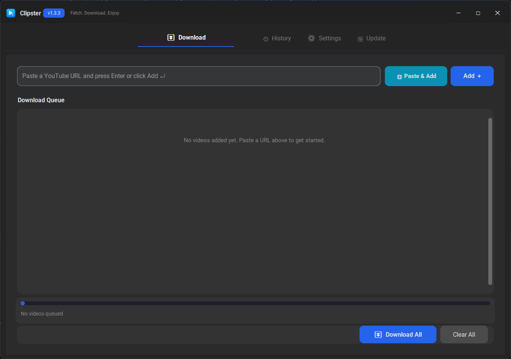

# 🎬 Clipster

**Modern Windows-native YouTube downloader built for speed, stability, and a clean UI.**

> Fetch. Download. Enjoy.

---

## 📸 Screenshots

---

## 🚀 What's New in v1.3.3

### 🚀 Improvements

- **Native System Notifications**: Integrated `win11toast` for native Windows system tray alerts.
- **High-DPI Awareness**: Fixed blurry scaling on high-resolution monitors.
- **Single Instance Lock**: Ensures only one instance of Clipster runs at a time; automatically brings the active window forward if launched again.
- **Local AppData Migration**: Downloads, settings, and internal assets now properly live in `%LOCALAPPDATA%\Clipster`, keeping your standalone `.exe` folder perfectly clean.
- **Updated Close Behavior**: The app now completely quits when the "X" button is pressed.

### 🐞 Fixes

- Fixed a syntax error in the yt-dlp auto-updater logic.
- Implemented robust asset bootstrapping for PyInstaller standalone builds to ensure bundled ffmpeg and yt-dlp binaries extract safely.

---

## ⚙️ Installation

### 1️⃣ Download from GitHub Releases

1. Visit the Releases page:
   👉 https://github.com/nisarg27998/Clipster/releases
2. Download **Clipster v1.3.1 (.exe)**
3. Run directly — no installation required.

---

## 📦 Bundled Tools

Clipster ships fully portable with:

- `yt-dlp.exe`
- `ffmpeg.exe`
- `ffprobe.exe`

> No Python or external dependencies required.

---

## 🧩 Core Features

- 🎞️ Single Video Downloader
- 📥 Multi-Video Queue System
- 📋 Inline Playlist Downloader
- 🎚 Resolution selector per video
- 📊 Per-item and overall progress tracking
- 💾 Persistent download history
- ⚙️ Configurable format, theme & download path
- 🔔 Windows 11 native notifications
- 🎨 Custom Windows 11 titlebar + Mica
- 🌙 Light / Dark theme support
- 🔄 Built-in update checker

---

## 🖥️ System Requirements

- Windows 10 or Windows 11 (64-bit)
- Recommended: 8 GB RAM or higher
- Active internet connection

---

## 🧾 License

Licensed under the MIT License  
© 2026 Nisarg Panchal

---

> 🧡 Built for speed, stability, and a clean Windows-native experience.
